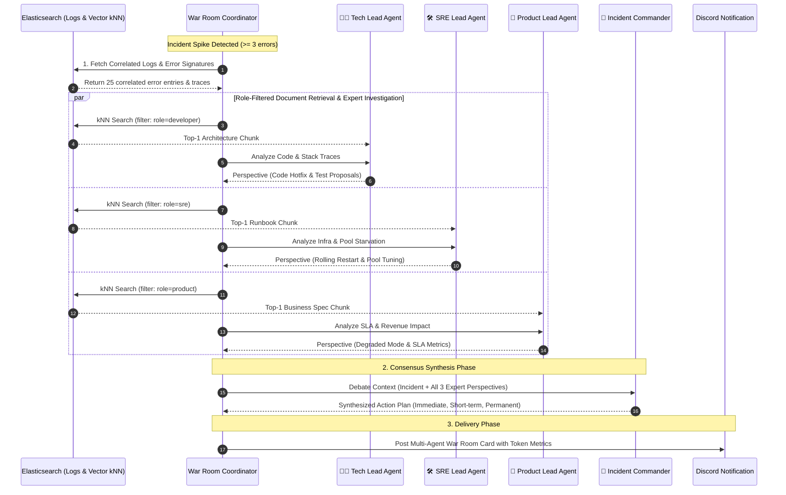

# Architecture Guide: AI Multi-Agent Incident War Room

## 1. Overview & Motivation

In traditional SRE automation, automated Root Cause Analysis (RCA) typically relies on a **Single-Prompt monolithic LLM call**. While quick to implement, this pattern suffers from severe production weaknesses:
- **Context Dilution:** When code, infrastructure, and business rules are combined into one massive prompt, the model hallucinates or glosses over critical nuances.
- **Role Confusion:** A single prompt struggles to distinguish between an immediate platform mitigation (e.g., Pod restart) and a permanent code fix (e.g., defer transaction rollback).
- **Excessive Token Overhead:** Pushing all documentation into one prompt quickly exhausts model token budgets and cloud rate limits.

To solve this, our agent implements the **Multi-Agent War Room Pattern**, modeling a real-world incident response command center where specialized AI personas independently investigate an incident and debate solutions before the Incident Commander synthesizes a binding action plan.

---

## 2. Multi-Agent War Room Lifecycle



---

## 3. Specialized Role Specifications

Each role is modeled as a functional node in the LangGraph StateGraph (`agent/src/nodes/`):

```typescript
export async function roleNode(state: WarRoomStateType): Promise<Partial<WarRoomStateType>>
```

### 🧑‍💻 1. Software Tech Lead & Code Architect (`agent/src/nodes/techLeadNode.ts`)
- **Primary Focus:** Application source code, stack traces, transaction lifecycles, and context propagation.
- **Investigation Targets:**
  - `nil-pointer dereference` panics and missing defensive checks.
  - Context deadline omissions (`context.WithTimeout`).
  - Database connection leaks (missing `defer tx.Rollback()`).
  - Unit/Integration test coverage gaps.
- **Knowledge Base Filter:** `target_role: "developer"` (e.g., `architecture-order-repo.md`).
- **Output:** Concrete code remediation proposals, PR guidance, and test recommendations.

---

### 🛠️ 2. Principal SRE & Platform Engineer (`agent/src/nodes/sreLeadNode.ts`)
- **Primary Focus:** Infrastructure health, container orchestration, connection pool saturation, and dependency resilience.
- **Investigation Targets:**
  - HikariCP / database pool starvation (active connections vs max connections).
  - Outbound latency and 3rd-party upstream timeouts (HTTP 504 / gateway failures).
  - Kubernetes pod crash loops and memory limits.
- **Knowledge Base Filter:** `target_role: "sre"` (e.g., `infra-runbook-db.md`).
- **Output:** Operational runbook commands, rolling restart procedures, circuit breaker settings, and config tuning.

---

### 👔 3. Product & Business Operations Lead (`agent/src/nodes/productLeadNode.ts`)
- **Primary Focus:** Customer experience, SLA compliance, revenue risk, and business fallback policies.
- **Investigation Targets:**
  - Estimated GMV revenue loss (e.g., Average Order Value [AOV] $\times$ failed checkout count).
  - Breach of SLA / SLO targets (e.g., 99.9% order success rate).
  - Customer retention and cart abandonment risks.
- **Knowledge Base Filter:** `target_role: "product"` (e.g., `business-campaign-rules.md`).
- **Output:** Activation of Degraded Mode (asynchronous queuing), customer messaging, and marketing campaign pauses.

---

### 👑 4. Incident Commander Agent (`agent/src/nodes/commanderNode.ts`)
- **Primary Focus:** Arbitration, cross-functional prioritization, and decisive consensus.
- **Investigation Targets:**
  - Synthesizing conflicting recommendations.
  - Assessing true incident severity (`CRITICAL`, `HIGH`, `MEDIUM`, `LOW`).
  - Structuring a chronological, actionable remediation runbook.
  - Deciding whether to trigger a second-pass cyclic deep-dive loop.
- **Output:**
  1. **Immediate Workaround (< 5 mins):** Rolling restart, scaling pool, switching to degraded mode.
  2. **Short-term Remediation (< 2 hours):** Hotfix deployment, config map tuning.
  3. **Permanent Prevention (< 2 sprints):** Circuit breaker implementation, transaction refactoring, integration tests.

---

## 4. Per-Role Token Usage & Cost Transparency

In a production environment, visibility into AI inference costs is essential. Every role independently tracks token usage using Gemini's API metadata:

```typescript
export interface RolePerspective {
  role: string;
  assessment: string;
  actionProposal: string;
  referencedDocs: string[];
  promptTokens: number;
  responseTokens: number;
  totalTokens: number;
}
```

---

## 5. Extensibility: Adding a New Role

To add a new role (e.g., `securityLeadNode`):
1. Create a new node in `agent/src/nodes/securityLeadNode.ts`.
2. Add a specialized markdown knowledge file under `docs/knowledge/` with metadata `Target Role: security`.
3. Register the new node and fan-out edge inside `buildWarRoomGraph()` in `agent/src/graph.ts`.
