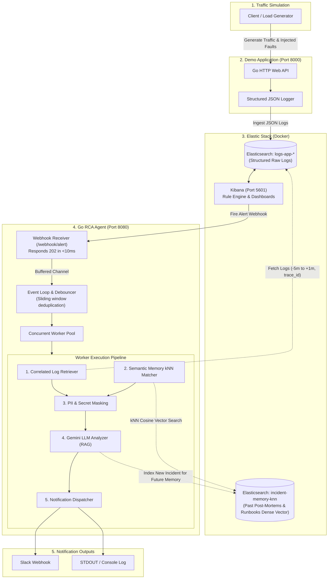

# System Architecture: Kibana AI RCA Agent

## 1. System Overview
The **Kibana AI RCA Agent** provides automated, intelligent Root Cause Analysis (RCA) and remediation suggestions for systems monitored by Elasticsearch and Kibana. It operates on an **event-driven on-demand** model with an internal **Event Loop** for alert deduplication and **Elasticsearch v8 Vector Search (kNN)** for semantic incident memory.



---

## 2. Component Breakdown

| Component | Technology | Description |
| :--- | :--- | :--- |
| **demo-app** | Go (`net/http`) | จำลอง Web API สั่งซื้อ/ชำระเงิน พร้อม endpoint จำลอง failure scenarios เช่น DB Pool Exhaustion, External Timeout, Null Pointer Panic |
| **Elasticsearch (Logs)** | Elasticsearch v8.x | จัดเก็บ Structured JSON Logs (`logs-app-*`) พร้อม `@timestamp`, `trace_id`, `service`, `level`, `message`, `stack_trace` |
| **Elasticsearch (Vector)** | Elasticsearch v8 Dense Vector | Index `incident-memory-knn` จัดเก็บ Post-mortems เก่าและ Runbooks ในรูปแบบ Dense Vector (kNN Search) |
| **Kibana** | Kibana v8.x | ตรวจจับ Alert Rule (เช่น 5xx Spike > 3 ครั้งใน 1 นาที) และยิง Webhook เข้า Agent |
| **rca-agent (Event Loop)** | Go Channels & Goroutines | รับ Webhook ตอบ 202 ทันที แล้วนำเข้า Buffer Event Loop เพื่อทำ Alert Debouncing / Deduplication |
| **rca-agent (Worker Pool)** | Go Workers | ดึง correlated logs, ค้นหา kNN memory, ทำ Data Sanitization และเรียก LLM |
| **LLM Engine** | Google Gemini (Gemini 2.5/Flash + Embeddings) | ทำ Vector Embedding และสร้าง Structured RCA พร้อมดึงความรู้จากเคสในอดีตมาช่วยตอบ |

---

## 3. End-to-End Workflow with Event Loop & Vector Memory

```mermaid
sequenceDiagram
    autonumber
    participant App as Demo App
    participant ES as Elasticsearch (Logs & Vector)
    participant Kibana as Kibana Alert
    participant Ingest as Webhook Receiver
    participant Loop as Event Loop & Worker
    participant LLM as Gemini LLM
    participant Slack as Slack Channel

    App->>ES: Stream Error Logs (DB Connection Pool exhausted)
    Kibana->>Kibana: Threshold exceeded
    Kibana->>Ingest: POST /webhook/alert
    Ingest-->>Kibana: 202 Accepted (<10ms)
    Ingest->>Loop: Push to Buffered Channel
    Loop->>Loop: Debounce & Deduplicate matching alerts (30s window)
    Loop->>ES: 1. Query Correlated Logs (logs-app-*, [-5m, +1m])
    ES-->>Loop: Return error logs & stack traces
    Loop->>ES: 2. Vector kNN Search (incident-memory-knn, query=error signature)
    ES-->>Loop: Return matching past post-mortems & internal runbooks
    Loop->>Loop: 3. Mask PII & Secrets
    Loop->>LLM: 4. Prompt: Correlated Logs + Past Incident Knowledge
    LLM-->>Loop: Structured RCA Report
    Loop->>Slack: 5. Dispatch Alert Card
    Loop->>ES: 6. (Optional) Index new incident post-mortem into Vector Memory
```

---

## 4. Vector Memory Schema (Elasticsearch kNN)

Index: `incident-memory-knn`

```json
{
  "mappings": {
    "properties": {
      "incident_id": { "type": "keyword" },
      "service": { "type": "keyword" },
      "error_signature": { "type": "text" },
      "embedding": {
        "type": "dense_vector",
        "dims": 768,
        "index": true,
        "similarity": "cosine"
      },
      "root_cause_summary": { "type": "text" },
      "resolution_steps": { "type": "text" },
      "resolved_at": { "type": "date" }
    }
  }
}
```
